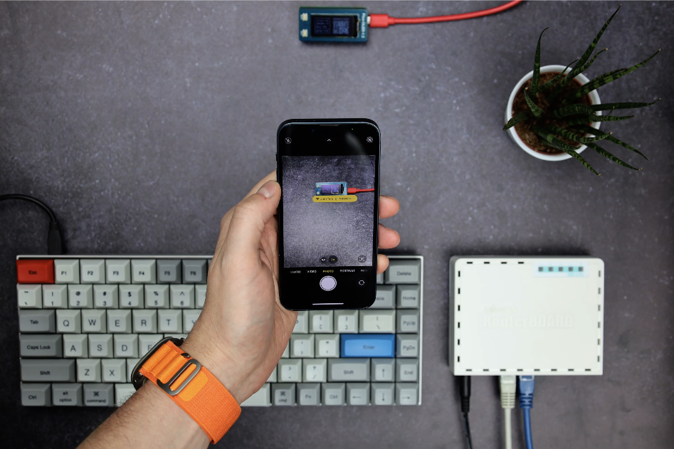

## What is this?

This repository will show you how to display a QR Code on a Raspberry Pi Pico display,
so that you can join a Wi-Fi network with style!

The acompanying video is on [YouTube](https://youtu.be/APTqu29ApRc).

Disclaimer: there are probably better ways to achieve this.

## TL;DR

Creating a guest Wi-Fi network on a router is something you'll have to figure out yourself for your router model.

Generate a QR Code with ASCII characters.
The string you encode must be in the correct format: `WIFI:S:<SSID>;T:<WEP|WPA|blank>;P:<PASSWORD>;H:<true|false|blank>;`

Prepare `main.py` (depends on the display you have), add QR Code in ASCII format, and copy `main.py` to your Pico.

Check `create_new_password_and_regenerate_qr_code.sh` for a all-in-one solution.
It uses MikroTik router as an example, SSH-es to it, resets the guest password,
and then creates a new QR code with Wi-Fi network credentials.
It also shows you how you can restart Raspberry Pi Pico without unplugging it.
With few modifications you can run this script in `cron` and reset your guest
Wi-Fi network on a schedule of your choosing.

## Details

#### Requirements

You'll need to create a guest Wi-Fi network on your router and you'll probably want to drop network packets
between that guest network and your private network.

This project uses Raspberry Pi Pico and a [Waveshare's Pico OLED 1.3 screen](https://www.waveshare.com/wiki/Pico-OLED-1.3) (64x128 pixels).
You'll need to edit the drawing logic in `main.py` if you are using a screen with different resolution.
You also can't use long SSID and/or long password on a screen this size. Limit calculations left as an exercise to the reader.

For adding support for MicroPython on your Raspberry Pi Pico, check the [official documentation](https://www.raspberrypi.com/documentation/microcontrollers/micropython.html).

#### Generating QR Code for joining a Wi-Fi network

To be able to join a Wi-Fi network by scanning a QR Code,
the string you encode must be in the following format:

`WIFI:S:<SSID>;T:<WEP|WPA|blank>;P:<PASSWORD>;H:<true|false|blank>;`

For my network with SSID `sre_g` and password `sre_gst!`, the string looks like this:

`WIFI:S:sre_g;T:WPA2;P:sre_gst!;;`

For encoding, I'm using `qrencode` tool, which by default creates a .png file.
I want to show it on a [Waveshare's Pico OLED 1.3 screen](https://www.waveshare.com/wiki/Pico-OLED-1.3) (64x128 pixels),
and you can do that by creating a QR Code with ASCII characters, and then paint the pixel WHITE if the character is present,
or paint it BLACK if the character is absent (actually if the character is space - ' ').

Another thing `qrencode` does by default is it creates an image (or ASCII, or whatever) which is larger than 64 pixels,
so you have to use additional flag to bring the size down (check `qrencode --help` for details).

The final command looks like this:

`qrencode -t ASCII -m 0 -o qr_ascii.txt 'WIFI:S:sre_g;T:WPA2;P:sre_gst!;;'`

Now you have QR Code in ASCII (`qr_ascii.txt`), but the dimensions are a bit off - it's 50 columns wide, but only 25 rows tall (this will depend on the length of SSID + password).
While it might look OK in a text editor, displaying it on pixel matrix will make it look like a rectangle,
so you'll have to duplicate each row:

`sed -i -e '/\(.*\)/p' qr_ascii.txt`

and then you need to prepare this as a list of strings (surround it with double quotes and add a comma at the end):

```
sed -i -e 's/\(.*\)/    "\1",/' qr_ascii.txt
```

#### Displaying QR Code on the display

Now you can insert the contents of `qr_ascii.txt` to `qr_code` list in `main.py`.

You should also edit the `msg` list in `main.py` to your liking.
I used `figlet` to create these.

First part of the code which initializes the OLED screen is taken from the [Waveshare Pico OLED 1.3 Wiki](https://www.waveshare.com/wiki/Pico-OLED-1.3).

Connect Raspberry Pi Pico to your computer and copy `main.py` to Pico (you need to figure which /dev Pico is on your machine, or use Pycharm/Thonny):

`rshell 'cp main.py /pyboard/main.py'`

and then replug your Pico.
